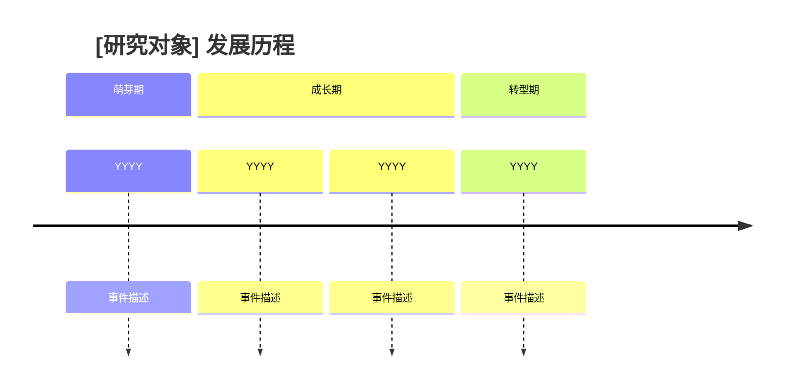
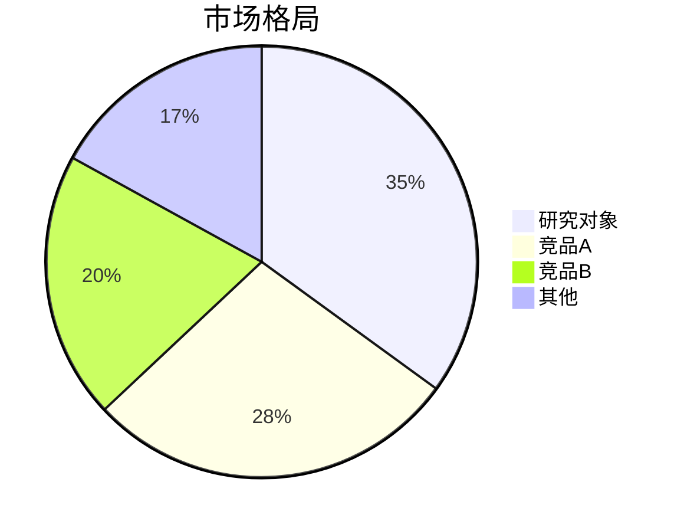
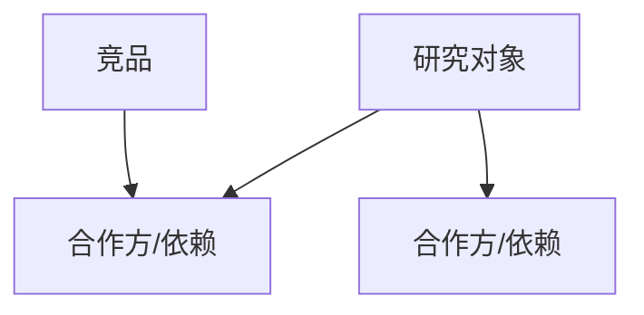
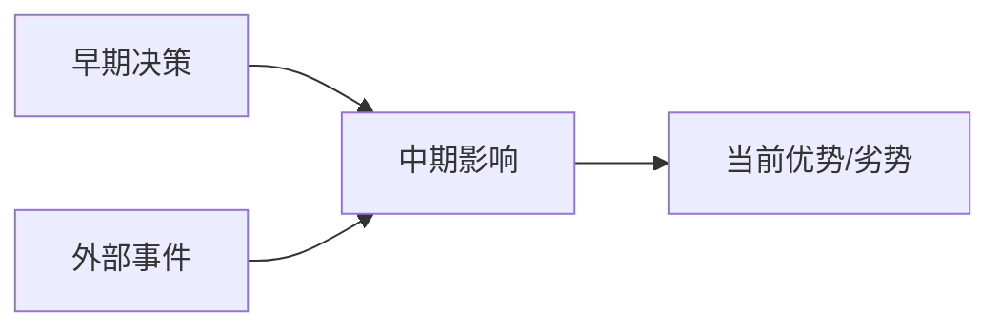
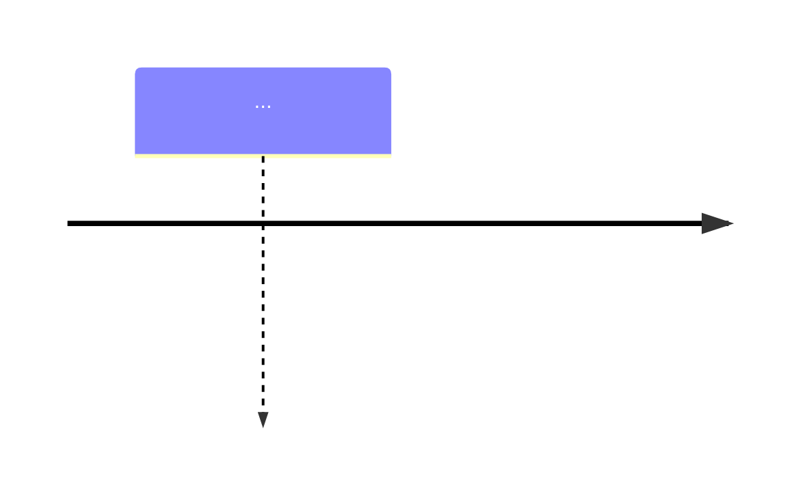

# ghost-research：横纵分析法深度研究

> **方法论溯源**
> 基于横纵分析法（by [@Khazix0918](https://x.com/Khazix0918)），融合了索绪尔的历时-共时分析、社会科学纵向-横截面研究设计、商学院案例研究法与竞争战略分析的核心思想。
> 原始框架：[github.com/KKKKhazix/khazix-skills](https://github.com/KKKKhazix/khazix-skills/tree/main/hv-analysis)
> 核心原则不变：纵向追时间深度，横向追同期广度，最终交汇出判断。

---

## 什么时候使用

适用于：
- 用户要求「横纵分析」「深度研究」「调研一下」「竞品分析」
- 用户想系统了解一个产品、公司、概念、技术、人物或赛道
- 用户需要形成 Obsidian / KBS 可沉淀的研究报告，而不是临时问答
- 用户需要把事实、来源、判断和后续观察点沉淀为可复用知识资产

不适用于：
- 简单名词解释
- 只需要一句话结论或快速事实查询
- 新闻简报、纯摘要、纯写作润色
- 用户明确要求不要联网，或不要写成长报告

---

## 与 wiki-research 配合

当研究对象适合查 wiki 类信息源时，`wiki-research` 可以作为后台补充：

- 补充 Wikipedia / Wikidata / 官方或项目 Wiki / Fandom / 社区 Wiki 来源；
- 提供别名、实体关系、作品/角色/组织关系、时间线、lore/canon 和社区分类线索；
- 标注官方来源、百科来源、社区维护内容和仍需验证的信息。

`ghost-research` 仍然负责完整横纵分析、证据评估、洞察判断和 KBS/Obsidian Markdown 输出。

---

## 前置准备

### 明确研究对象

拿到用户输入后，确认以下信息。如果用户已经给得足够明确（比如「帮我用横纵分析法研究 Hermes Agent」），不需要追问，直接开始：

1. **研究对象**：具体的产品名/公司名/概念名/人名
2. **类型**：产品、公司、概念、人物、还是其他？
3. **研究动机**（可选）：为什么要研究它？最近发生了什么？
4. **特别关注点**（可选）：有没有特别想深入的方向？

---

## 第一步：联网信息收集

这个方法论的质量完全取决于信息的丰富度和准确性。**必须联网搜索**，不能仅靠已有知识。

### 并行搜索策略

根据信息复杂度决定是否使用子 Agent。对象复杂、信息面很广、涉及多个竞品/历史阶段/市场维度时，使用子 Agent 并行搜索。建议分工：

- **子 Agent 1 — 纵向信息**：研究对象的起源、创始人背景、发展历程、关键事件、版本迭代、融资、战略转向、危机
- **子 Agent 2 — 横向信息**：竞品识别、各竞品特点和用户口碑、行业对比评测、市场份额
- **子 Agent 3**（复杂对象才需要）：补充信息，如创始人深度背景、行业环境、用户社区讨论（GitHub Issues、Reddit、Twitter/X、知乎）

每个子 Agent 的 prompt 中应包含以下联网指引：

> 你需要联网获取信息，使用当前环境可用的搜索、网页读取、浏览器或终端检索工具。普通公开网页优先使用轻量搜索；动态、登录、交互页面再使用浏览器工具。多次搜索、多个关键词组合，不要只搜一次就放弃。一手来源优于二手来源：官方博客 > 权威媒体原创报道 > 转载/聚合。如果研究对象涉及学术概念、算法、AI 模型或技术范式，应检索 arXiv / 论文来源。优先使用可用的 arxiv skill 或官方 arXiv API；关键词需要正确 URL encode，不要直接把中文关键词硬塞进 URL。
> 如果研究对象涉及百科背景、人物/组织/作品关系、IP/lore/canon、项目 Wiki、Fandom/社区 Wiki 或 Wikidata 实体关系，可让 `wiki-research` 在后台补充相关 wiki 类信息源、别名、时间线和关系线索；不要把 wiki 来源当作当前商业、价格、政策或市场结论的主要依据。

### 信息来源优先级

| 信息类型 | 一手来源 |
|---------|---------|
| 产品更新/技术决策 | 官方博客、GitHub Release Notes、创始人推文 |
| 融资/商业数据 | 公司官方公告、SEC/工商文件 |
| 用户口碑 | GitHub Issues、Reddit、Twitter/X、知乎 |
| 行业分析 | 权威媒体原创报道（非转载） |
| 学术/技术原理 | arXiv 论文、Google Scholar |

### AI 辅助研究边界

AI 可以加速资料搜集、归纳、交叉比较和假设生成，但不能把推测包装成用户事实。

- 公开评论、社区讨论、评测文章可以作为用户洞察线索，但不等同于真实用户访谈结论。
- AI 模拟用户、合成用户、角色扮演回答只能用于生成假设，不能作为最终判断依据。
- 涉及关键产品、市场、定价、用户需求判断时，如果缺少真实用户证据，要明确标注「需要真实用户验证」。
- 不要因为多个二手来源重复同一说法就视为交叉验证；优先追到原始数据、官方披露、原始访谈或一手评论。

### 证据矩阵

分析过程中维护一张证据矩阵，用来约束关键判断：

| 判断 | 支撑证据 | 来源类型 | 置信度 | 反证/不确定性 |
|------|----------|----------|--------|----------------|
| 关键判断 1 | 具体事实/数据/引用 | 官方/用户/媒体/论文 | 高/中/低 | 可能的反例、缺口或偏差 |

报告正文不必机械展示所有中间证据，但最终的核心结论必须能追溯到这张矩阵。

### 信息充分性自检

搜索完成后检查：
- 纵向：能讲出一个完整的故事吗？有没有明显的信息断层？
- 横向：竞品列表完整吗？每个竞品的信息够做对比吗？
- 来源：关键事实有可靠来源支撑吗？
- 证据：核心判断是否有证据矩阵支撑？有没有反证或明显盲点？

信息不够就再补搜，不要凑合。

---

## 第二步：纵向分析（Diachronic / Longitudinal）

沿时间轴，完整还原研究对象从诞生到现在的发展全貌。这是报告的主体部分，篇幅应该最重。

### 内容要求

**起源追溯**：诞生背景、技术/理念/需求基础、创始团队或核心推动者是谁、他们之前做过什么、当时行业环境、直接触发事件或灵感。

**诞生节点**：首次发布/成立/提出时间，最初形态和定位，跟现在有何不同。

**演进历程**：从诞生到现在，按时间顺序梳理所有关键节点，包括：重大版本更新、融资事件、团队变动、战略转型、技术架构变化、用户规模里程碑、重大合作或收购、公关危机或争议事件。

**决策逻辑**：每个关键节点，还原决策背后的原因——为什么选 A 而不是 B？当时的约束条件是什么？哪些早期决策「锁定」了后来的方向难以逆转？

**阶段划分**：把整个历程自然分为几个阶段（萌芽期、快速增长期、转型期等），每个阶段有核心特征和核心矛盾。

### Mermaid 时间线

当纵向分析中存在 3 个以上明确时间节点，且时间顺序对理解对象很关键时，生成 Mermaid `timeline` 图。否则使用简洁表格或项目符号，不要为了图而图：



### 篇幅

6000-15000 字。宁可写长写细，也不要蜻蜓点水。

---

## 第三步：横向分析（Synchronic / Cross-sectional）

以当前时间点为切面，将研究对象与同赛道竞品/同类进行全面对比。

### 首先判断竞品情况

**场景 A：无直接竞品。** 分析：为什么没有竞品？未来最可能从哪个方向冒出竞争者？有没有间接替代方案？

**场景 B：少量竞品（1-2 个）。** 逐一深入对比，每个竞品展开详细分析。

**场景 C：竞品充分（3 个及以上）。** 选取最具代表性的 3-5 个进行对比，其余简要提及。

### 用户 / 客户视角

横向分析不能只看公司、功能和融资，还要还原真实用户为什么选择、放弃或替代它：

- **目标用户 / ICP**：核心用户是谁？是个人用户、创作者、开发者、企业团队、采购方，还是某个垂直行业？
- **JTBD / 使用任务**：用户雇佣它完成什么任务？节省时间、降低成本、提高质量、获得分发、完成合规，还是获得情绪/身份价值？
- **替代方案**：用户不用它时用什么？竞品、内部自研、人工流程、外包、Excel/Notion/脚本，还是干脆不解决？
- **痛点和触发因素**：什么问题会让用户开始寻找方案？什么事件会触发购买、迁移或试用？
- **使用与流失原因**：用户实际怎么用？最常见的槽点是什么？为什么留存、迁移或放弃？
- **迁移成本**：数据、工作流、团队习惯、集成生态、学习成本和合同周期是否形成锁定？

如果只有公开评论和社区讨论，写成「用户信号」而不是「用户结论」；关键判断需要在文末标注是否还需要真实用户验证。

### 对比维度

**核心差异对比**：技术路线/底层逻辑、产品形态/商业模式、目标用户/适用场景、核心优劣势、定价策略/规模体量。

**用户视角**：真实用户口碑，社区评价中的优点和槽点，用户实际使用方式和官方定位有没有偏差。对比要讲清楚每个竞品「活成了什么样」，用户选它的真实理由是什么；无法验证的用户需求推断必须标注。

**生态位分析**：在整个赛道版图中的位置，填补了什么空白，还是正面竞争。

**趋势判断**：在竞争格局中的走向，机会和风险各是什么。

### 竞品拆解模板

主要竞品用同一套维度拆解，避免只写印象流：

| 维度 | 研究对象 | 竞品 A | 竞品 B | 竞品 C |
|------|----------|--------|--------|--------|
| 定位 |  |  |  |  |
| 目标用户 / ICP |  |  |  |  |
| 核心 use case |  |  |  |  |
| 关键功能 / 体验 |  |  |  |  |
| 定价 / 商业模式 |  |  |  |  |
| 分发 / GTM |  |  |  |  |
| 技术或数据壁垒 |  |  |  |  |
| 生态 / 渠道 / 合作 |  |  |  |  |
| 用户迁移成本 |  |  |  |  |
| 增长飞轮 |  |  |  |  |
| 主要风险 |  |  |  |  |

表格用于约束分析，不必为了完整而堆空字段；正文只展开真正决定竞争格局的差异。

### Mermaid 竞争格局图

横向分析完成后，根据实际情况选择以下一种或多种图表：

**四象限市场定位**（当竞品可以用两个维度清晰区分时使用）：

```mermaid
quadrantChart
    title 竞争格局：[维度X] vs [维度Y]
    x-axis 低[维度X] --> 高[维度X]
    y-axis 低[维度Y] --> 高[维度Y]
    quadrant-1 [象限名称]
    quadrant-2 [象限名称]
    quadrant-3 [象限名称]
    quadrant-4 [象限名称]
    研究对象: [0.7, 0.8]
    竞品A: [0.3, 0.6]
    竞品B: [0.5, 0.4]
```

**市场份额饼图**（当有可靠的市场份额数据时使用）：



**生态系统关系图**（当研究对象涉及复杂的依赖/合作关系时使用）：



**判断原则**：不要为了用图而用图。以下情况适合加 Mermaid：信息之间有明确的时间顺序、层级关系、位置关系、比例关系，且文字描述会让读者需要自己在脑子里画图。反之，如果用表格或文字已经足够清晰，不需要强行加图。

### 篇幅

3000-10000 字。场景 A 控制在 3000 字左右，场景 C 每个主要竞品至少 1500 字以上的独立分析。

---

## 第四步：横纵交汇洞察

把纵向发展脉络和横向竞争格局结合起来，给出综合性的、新的判断。不要写成前面内容的缩写版。

需要回答的核心问题：

1. **历史如何塑造了当下的竞争位置**：纵向历程中哪些决策决定了今天横向对比中的位置？
2. **竞品的纵向对比**：主要竞品的起源和演变路径有什么不同？如何导致了今天各自的特点？
3. **优势的历史根源**：今天每个核心优势，能追溯到历史上的哪个节点或决策？
4. **劣势的历史根源**：今天每个核心劣势，当初的「好决策」有没有变成今天的包袱？
5. **未来推演**：基于纵向趋势和横向格局，给出三个剧本——最可能的、最危险的、最乐观的，每个有逻辑支撑。

### 反证与盲点

洞察部分必须主动处理反面信息：

- 哪些主流叙事可能是错的？
- 哪些来源有利益相关、幸存者偏差或媒体放大效应？
- 哪些关键数据缺失，只能暂时推断？
- 有没有反向案例说明这个判断不总成立？
- 如果未来出现什么信号，当前判断需要被推翻或重写？

### 行动建议 / Watchpoints

不要只停在洞察，要给出下一步判断框架：

- **是否值得继续跟踪**：值得 / 不值得 / 只在特定信号出现时跟踪。
- **可采取动作**：试用、访谈、合作、投资、规避、继续观察，或建立定期追踪。
- **下一步验证**：还需要查什么数据、问什么用户、验证什么假设？
- **关键观察信号**：产品发布、融资、定价变化、用户迁移、监管变化、头部客户、社区活跃度、负面口碑。
- **判断更新条件**：哪些事实出现后，报告里的核心结论需要更新？

### Mermaid 因果关系图（可选）

当历史决策和当前结果之间的因果链特别值得可视化时使用：



### 篇幅

1500-3000 字。

---

## 第五步：输出为 Obsidian Markdown

报告写完后，整理为标准的 Obsidian Markdown 格式，并默认进入 KBS 写入流程。

用户要求「深度研究」「调研」「研究一下」某个对象时，默认视为需要沉淀到个人 KBS 或项目 KBS；不要再追问「是否保存」。但实际执行文件写入前，必须遵守当前环境的文件修改审批、路径确认和覆盖保护规则。

只有在以下情况才追问：
1. 无法判断应该写入个人 KBS 还是项目 KBS；
2. 目标文件已存在，存在覆盖风险；
3. 用户明确要求只在对话中输出，不写入文件。

### Frontmatter 模板

每份报告文件头部使用以下 frontmatter：

```yaml
---
title: "[研究对象] 横纵分析报告"
date: YYYY-MM-DD
tags:
  - 市场调研
  - 横纵分析
  - "[研究对象所属赛道]"
  - "[研究对象类型：产品/公司/概念/人物]"
aliases:
  - "[研究对象]分析"
  - "[研究对象]调研"
status: active
type: 调研报告
research_object: "[研究对象]"
research_scope: "[研究范围]"
confidence: 高/中/低
related_notes:
  - "[[相关调研报告1]]"
  - "[[相关调研报告2]]"
---
```

### Obsidian 特有语法规范

**执行摘要**（报告正文最开头，Frontmatter 之后）：

```markdown
> [!info] 执行摘要
> **研究对象**：X | **日期**：YYYY-MM-DD | **写入位置**：个人 KBS / 项目 KBS
>
> **三个最重要发现**：
> 1. 发现 1（置信度：高）
> 2. 发现 2（置信度：中）
> 3. 发现 3（置信度：高）
>
> **一个反直觉的点**：...
>
> **对我们的战略含义**：...
```

**Callout 块使用规则**：

- `> [!tip]` — 值得记住的洞察、有趣的细节
- `> [!warning]` — 风险点、需要二次核实的信息、AI 置信度低的内容
- `> [!info]` — 背景信息、补充说明
- `> [!quote]` — 引用创始人/关键人物的原话

**双链**：正文中每次提到已有调研报告的研究对象时，用 `[[文件名]]` 格式，例如 `[[Cursor 竞品分析]]`。

**置信度标注**：对无法确认的推测，行内用 `（置信度：低，推测）` 标注，并在报告末尾汇总「证据矩阵 / 信息可靠性评估」：

```markdown
## 证据矩阵与信息可靠性评估

| 判断 | 支撑证据 | 来源类型 | 置信度 | 反证/不确定性 |
|------|----------|----------|--------|----------------|
| 判断 1 | 官方公告 / 数据 / 原始评论 | 官方 | 高 | 暂无明显反证 |
| 判断 2 | 社区讨论 / 用户评论 | 用户信号 | 中 | 样本偏差，需真实用户验证 |
| 判断 3 | 基于公开信息推断 | 推测 | 低 | 缺少一手数据 |
```

### 文件命名与保存路径

优先写入当前用户已配置或上下文明确的个人 KBS / 项目 KBS 路径。以下路径仅作为通用示例，fork 后应替换为自己的 vault 或知识库目录：

```
~/Research/reports/YYYY-MM-DD-[研究对象]-[类型].md

示例：
~/Research/reports/2026-05-17-Cursor-竞品深度分析.md
~/Research/reports/2026-05-10-AI编程工具赛道-市场全景.md
```

### 报告完整结构模板

~~~markdown
---
[frontmatter]
---

> [!info] 执行摘要
> ...

## 一、一句话定义

[用一句话说清楚这个东西是什么]

## 二、纵向分析：从诞生到当下

[完整纵向叙事，6000-15000 字]



## 三、横向分析：竞争图谱

[横向对比分析，3000-10000 字]

```mermaid
quadrantChart / pie / graph
    ...
```

## 四、横纵交汇洞察

[交叉分析和未来推演，1500-3000 字]

## 五、行动建议与 Watchpoints

[是否继续跟踪、可采取动作、下一步验证、关键观察信号、判断更新条件]

## 六、证据矩阵与信息可靠性评估

[核心判断、支撑证据、来源类型、置信度、反证/不确定性]

## 七、延伸阅读

[5-10 个进一步研究的资源]

---
*基于横纵分析法（by @Khazix0918）| 生成于 YYYY-MM-DD*
~~~

---

## 写作风格

这不是一份冷冰冰的咨询报告，而是一篇让人能从头读到尾的深度研究。

### 核心原则

**节奏感**：句子时长时短，段落之间跳跃自然。一句话自成一段制造重量感的技巧可以用。

**叙事驱动，不是罗列驱动**：纵向部分要有故事弧线，有起承转合。不要写成「2023 年 1 月发布了 A，2023 年 3 月发布了 B」这种流水账。

**敢下判断**：鼓励给出观点和洞察，但每个观点必须有事实支撑。先摆事实，再给判断。是推测的明确标注，用「我的判断是」而不是居高临下的定论。

**层层剥开**：不直接讲结论，用「现象 → 表面解释 → 更深的追问 → 核心洞察」的方式展开。

**具体而非概括**：不要写「该公司实现了快速增长」，要写「从 2024 年中期的 1000 万美元 ARR 到 2025 年底的 10 亿美元，增长曲线几乎是垂直的」。

**回环呼应**：开头或纵向部分埋的细节，在交汇洞察或结尾 callback 回来，制造前后因果的闭合感。

### 绝对禁区

无论什么情况都不能出现：
- 套话：「首先…其次…最后」、「综上所述」、「值得注意的是」、「不难发现」
- 空洞词：「赋能」、「抓手」、「打造闭环」
- 教科书开头：「在当今 AI 快速发展的时代」、「随着技术的不断进步」
- 编造数据：搜不到的信息，诚实标注「该信息暂缺」，绝不编造

---

## 不同研究对象类型的适配

核心原则不变，侧重点不同：

**研究产品时**：纵轴重点关注版本迭代、技术路线演变、用户增长曲线、关键产品决策；横轴重点关注功能对比、用户体验、定价。

**研究公司时**：纵轴重点关注创始团队、融资历程、战略转向、组织变革；横轴重点关注商业模式差异、市场份额、营收对比。

**研究概念时**（技术范式、商业模式、文化现象）：纵轴重点关注概念起源（谁提出、基于什么理论）、如何流行、经历哪些争论；横轴重点关注与相近概念的区别、各自适用场景。

**研究人物时**：纵轴重点关注个人经历、职业轨迹、关键决策；横轴重点关注与同领域其他人物的对比（做事方式、风格、影响力、路线选择差异）。

---

## 篇幅总览

| 部分 | 字数范围 | 说明 |
|-----|---------|------|
| 纵向分析 | 6,000–15,000 字 | 报告主体，不要蜻蜓点水 |
| 横向分析 | 3,000–10,000 字 | 视竞品数量调整 |
| 横纵交汇 | 1,500–3,000 字 | 精华段，给出新判断 |
| 行动建议 / Watchpoints | 500–1,500 字 | 给出下一步验证和观察信号 |
| **全文总计** | **10,000–30,000 字** | 不要怕长，深度和完整度是价值所在 |

---

## 质检清单

交付前自检：

- [ ] 纵轴是叙事故事体？有因果逻辑和时代脉络？不是年表流水账？
- [ ] 创始人/发起者的背景和动机有足够深度？
- [ ] 每个关键节点都展开写了，没有为了压缩跳过重要细节？
- [ ] 决策逻辑有还原？不只是「发生了什么」，还有「为什么这么选」？
- [ ] 横轴的竞品场景判断正确（A/B/C）？竞品分析够深？
- [ ] 目标用户 / ICP、JTBD、替代方案、痛点和迁移成本讲清楚了吗？
- [ ] 主要竞品是否按定位、use case、定价、GTM、壁垒、迁移成本等维度拆解？
- [ ] 用户口碑部分引用了真实用户的声音？不只是官方宣传？
- [ ] AI 推断、公开评论和真实用户证据之间的边界标清楚了吗？
- [ ] 横纵交汇产出了新的判断，不是前面内容的缩写版？
- [ ] 未来推演的三个剧本都有逻辑支撑？
- [ ] 是否主动写出反证、盲点和判断更新条件？
- [ ] 是否给出行动建议、下一步验证和 watchpoints？
- [ ] Mermaid 图表是因为信息本身需要可视化才加的，不是为了装饰？
- [ ] 图表类型和数据匹配（时间线用 timeline，位置用 quadrant，占比用 pie）？
- [ ] Frontmatter 填写完整，tags/aliases/related_notes 都有？
- [ ] 执行摘要在报告最开头，200 字以内，含战略含义？
- [ ] 证据矩阵与信息可靠性评估在报告末尾？
- [ ] 报告已写入合适的个人 KBS 或项目 KBS 路径；如存在路径歧义或覆盖风险，已先处理？
- [ ] 没有触犯绝对禁区里的任何一条？
- [ ] 所有关键事实标注了信息来源？搜不到的诚实标注「暂缺」，没有编造？
